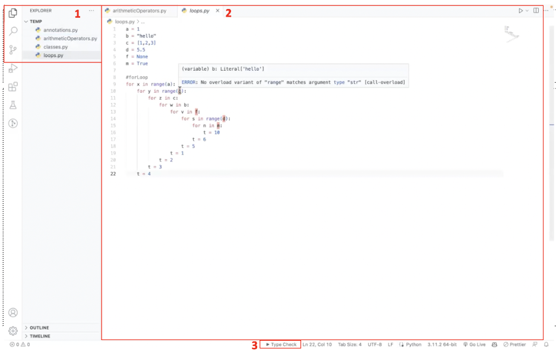
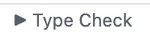
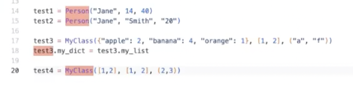
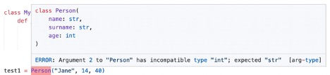

# Python Static Type Checker
The following is the user documentation for this project.
## Overview
### About the product
Python Static Type Checker does static type analysis on Python programs in order to address these problems as a VS Code extension. It shows variable types on hover and highlights type mismatches, improving the efficiency of developers and reducing the likelihood of errors in more complex code. Thus, the type checker tool keeps track of allowed variable types, scans the file for errors in variables, parameters, and functions typing, and presents those errors to the user. Error lines shown after type analysis improve the development process because static typing lessens the likelihood of runtime mistakes, and assists with any type mismatches in the software program. 
### User interface

  
   
  Figure-1. Main components of the user interface.

The user interface consists of three main components highlighted in Figure-1: 
1 - Explorer with all the files of your project. 
2 - Editor where you can see and edit your files. 
3 - Type Check button, which enables the type checker and processes your file. 

### Main features of the system 
- The system identifies types and type mismatches in a basic Python program with conditions, loops, assignments, functions, and classes.
- The system outputs the description of the problem with the potential types of each variable after type checker execution.
- The system shows the type of the variable on hover.
- The system indicates the line with an error.
## Requirements
### Hardware requirements
The extension easily runs on the VS Code, which is supported by the most modern hardware. It is recommended to use a 1.6 GHz or faster processor and 1 GB of RAM.
### Software requirements
As the type checker is an extension of VS Code, it is supported by the next platforms: 
- Windows 8.0, 8.1 and 10, 11 (32-bit and 64-bit)
- OS X High Sierra (10.13+)
- Linux (Debian): Ubuntu Desktop 16.04, Debian 9
- Linux (Red Hat): Red Hat Enterprise Linux 7, CentOS 7, Fedora 34 
### Relevant background information
To use the type checker efficiently, the user should have familiarity with the next technologies and concepts: 
- Basic knowledge of Python programming
- Prior experience using VS Code and its extensions
## Installation and setup guide
1. Copy the project HTTPS or GitHub CLI.
2. Open the terminal and go to the directory where you want your project to be located.
3. Type `git clone` and paste the copied URL.
4. Go to the cloned repository and import the project to the VS Code code editor.
5. Run `npm install` to install the required packages.
6. Run the project by pressing F5 and the new VS Code window will open.
7. Use the opened window as your working space and import your Python files there.
## Instructions on how to use the system
1. Open the directory of your project in the opened VS Code window.
2. To perform type check on your Python file, press the Type Check button (see Figure-2) on the lower bar of VS Code. 
    Figure-2. Type Check button. 

3. After performing the type check, the extension will highlight all the type mismatches in your file as in Figure-3. This way you can see exactly which line and variable causes an error. Then hover over the highlighted variable to see error details (see Figure-4). 
    Figure-3. Error highlight after type check. 
 
    Figure-4. Error details of the highlighted variable. 

4. You can also see all the types of a variable by simply hovering over its *first symbol*.
## Contacts
For any enquiries and suggestions, please do not hesitate to send an email to one of the next addresses: 
<a href="mailto:akerke.tolegen@nu.edu.kz" target="_blank">akerke.tolegen@nu.edu.kz</a> 
<a href="mailto:a.sagadiyeva@nu.edu.kz" target="_blank">a.sagadiyeva@nu.edu.kz</a> 
<a href="mailto:timur.rakhishov@nu.edu.kz" target="_blank">timur.rakhishov@nu.edu.kz</a> 
<a href="mailto:bekzat.skakov@nu.edu.kz" target="_blank">bekzat.skakov@nu.edu.kz</a> 
<a href="mailto:temirlan.bazarzhan@nu.edu.kz" target="_blank">temirlan.bazarzhan@nu.edu.kz</a> 
